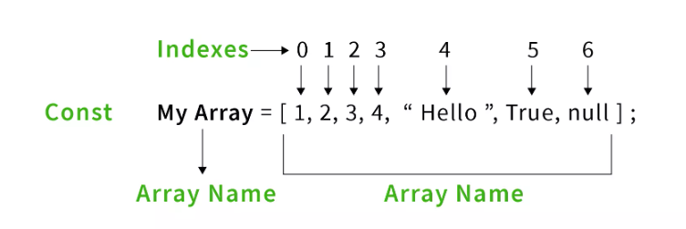

# Buổi 5: Mảng, Tuples và Vòng lặp


**Mục tiêu:** Hiểu cách làm việc với mảng và tuples, đồng thời sử dụng các vòng lặp để xử lý dữ liệu.


## 💛 **Dữ liệu kiểu mảng** 

### 🔥**Khái niệm**
Mảng (Array) trong JavaScript là một đối tượng đặc biệt dùng để lưu trữ và quản lý một danh sách các phần tử. Mỗi phần tử có thể là một giá trị thuộc bất kỳ kiểu dữ liệu nào như số, chuỗi, đối tượng, hoặc thậm chí là một mảng khác (mảng lồng nhau).



### 🔥**Đặc điểm của mảng trong JavaScript**
1. **Định chỉ số (index-based):**
   - Các phần tử trong mảng được truy cập thông qua chỉ số, bắt đầu từ `0`.
   - Ví dụ: Trong mảng `const arr = [10, 20, 30];`, `arr[0]` là `10`.

2. **Hỗ trợ kiểu dữ liệu hỗn hợp:**
   - Một mảng có thể chứa các giá trị thuộc nhiều kiểu dữ liệu khác nhau.
   - Ví dụ: `const mixedArray = [1, "Hello", true, { key: "value" }];`.
   - Mảng như thế này trong Typescript gọi là `Tuple`

3. **Độ dài động:**
   - Mảng trong JavaScript không cần định trước kích thước. Bạn có thể thêm hoặc xóa phần tử một cách linh hoạt.

4. **Là một đối tượng:**
   - Mặc dù mảng trông giống như một danh sách các giá trị, thực chất nó là một đối tượng có các thuộc tính và phương thức để thao tác.

### 🔥**Khi nào sử dụng mảng**
- Khi cần lưu trữ một tập hợp các giá trị mà có thể truy cập thông qua chỉ số.
- Khi cần thực hiện các thao tác như duyệt, tìm kiếm, thêm, xóa, hoặc biến đổi trên một danh sách các giá trị.

### 🔥**Ví dụ về khai báo mảng**
1. **Tạo mảng rỗng:**
   ```javascript
   const emptyArray = [];
   console.log(emptyArray); // []
   ```

2. **Tạo mảng với giá trị khởi tạo:**
   ```javascript
   const numbers = [1, 2, 3, 4];
   console.log(numbers); // [1, 2, 3, 4]
   ```

3. **Sử dụng `new Array()`:**
   ```javascript
   const array = new Array(5); // Tạo một mảng rỗng với độ dài 5
   console.log(array); // [ <5 empty items> ]
   ```

### 🔥**Các thao tác cơ bản trên mảng**

1. **Truy cập phần tử:**
   ```javascript
   const fruits = ["Apple", "Banana", "Mango"];
   console.log(fruits[0]); // Apple
   console.log(fruits[2]); // Mango
   ```

2. **Thay đổi giá trị phần tử:**
   ```javascript
   const fruits = ["Apple", "Banana", "Mango"];
   fruits[1] = "Orange"; // Thay "Banana" thành "Orange"
   console.log(fruits); // ["Apple", "Orange", "Mango"]
   ```

3. **Thêm phần tử:**
   - Sử dụng `push` để thêm vào cuối mảng:
     ```javascript
     const fruits = ["Apple", "Banana"];
     fruits.push("Mango");
     console.log(fruits); // ["Apple", "Banana", "Mango"]
     ```
   - Sử dụng chỉ số để thêm vào vị trí cụ thể:
     ```javascript
     const fruits = ["Apple", "Banana"];
     fruits[2] = "Mango"; // Thêm "Mango" tại chỉ số 2
     console.log(fruits); // ["Apple", "Banana", "Mango"]
     ```

4. **Xóa phần tử:**
   - Sử dụng `pop` để xóa phần tử cuối:
     ```javascript
     const fruits = ["Apple", "Banana", "Mango"];
     fruits.pop();
     console.log(fruits); // ["Apple", "Banana"]
     ```
   - Sử dụng `splice` để xóa phần tử tại vị trí bất kỳ:
     ```javascript
     const fruits = ["Apple", "Banana", "Mango"];
     fruits.splice(1, 1); // Xóa 1 phần tử tại chỉ số 1
     console.log(fruits); // ["Apple", "Mango"]
     ```
---

## 💛**Mảng trong TypeScript** 

### 🔥**Khái niệm**

Mảng (Array) trong TypeScript là một kiểu dữ liệu cho phép lưu trữ nhiều giá trị cùng kiểu trong một danh sách có thứ tự. TypeScript cung cấp khả năng xác định kiểu dữ liệu của các phần tử trong mảng, giúp kiểm soát chặt chẽ hơn so với JavaScript.


### 🔥**Đặc điểm của mảng trong TypeScript**

1. **Chỉ chứa các phần tử cùng kiểu:** 
   - Bạn có thể khai báo kiểu của mảng, ví dụ: `number[]` chỉ chứa các số.
   - Nếu cần mảng chứa nhiều kiểu, có thể dùng `union type` hoặc `any`.

2. **Hỗ trợ kiểm tra kiểu tại thời điểm biên dịch:** 
   - Nếu bạn cố gắng thêm giá trị sai kiểu, TypeScript sẽ báo lỗi.

3. **Được triển khai dựa trên mảng của JavaScript:** 
   - Do đó, mảng TypeScript thừa hưởng tất cả các phương thức của mảng trong JavaScript.

---

### 🔥**Khai báo và khởi tạo mảng**

TypeScript cung cấp hai cú pháp chính để khai báo mảng:

1. **Dùng cú pháp `T[]` (mảng kiểu `T`):**
   ```typescript
   let numbers: number[] = [1, 2, 3, 4];
   let strings: string[] = ['TypeScript', 'JavaScript'];
   console.log(numbers); // [1, 2, 3, 4]
   console.log(strings); // ['TypeScript', 'JavaScript']
   ```

2. **Dùng cú pháp `Array<T>` (mảng kiểu `T`):**
   ```typescript
   let numbers: Array<number> = [10, 20, 30];
   let booleans: Array<boolean> = [true, false];
   console.log(numbers); // [10, 20, 30]
   console.log(booleans); // [true, false]
   ```

3. **Mảng hỗn hợp kiểu (Union Types hoặc `any`):**
   ```typescript
   let mixed: (number | string)[] = [1, 'Hello', 2, 'World'];
   let anyArray: any[] = [1, true, 'TypeScript', { key: 'value' }];
   console.log(mixed); // [1, 'Hello', 2, 'World']
   console.log(anyArray); // [1, true, 'TypeScript', { key: 'value' }]
   ```

---


## 💛**Tuples trong TypeScript**  

### 🔥**Khái niệm**
Tuples (bộ giá trị) trong TypeScript là một kiểu dữ liệu đặc biệt, cho phép lưu trữ một tập hợp các giá trị với số lượng cố định và mỗi giá trị có thể thuộc các kiểu dữ liệu khác nhau.  
Tuples thường được sử dụng để nhóm các giá trị có liên quan nhưng khác kiểu dữ liệu, ví dụ như một cặp giá trị (tên, tuổi) hoặc bộ ba giá trị (id, tên, trạng thái).

---

### 🔥**Khai báo Tuples**

1. **Cú pháp cơ bản:**
   ```typescript
   let tupleName: [type1, type2, ...];
   ```
   - Xác định thứ tự và kiểu của các phần tử.

2. **Ví dụ khai báo và khởi tạo:**
   ```typescript
   let user: [string, number];
   user = ['Alice', 30]; // Đúng
   console.log(user); // ['Alice', 30]
   ```

   **Lưu ý:**
   - Thứ tự và kiểu dữ liệu phải khớp với định nghĩa.
   - Nếu sai thứ tự hoặc kiểu, TypeScript sẽ báo lỗi:
     ```typescript
     user = [30, 'Alice']; // Lỗi: Type 'number' không khớp với kiểu 'string' tại vị trí đầu tiên.
     ```

---

### 🔥**Các thao tác cơ bản với Tuples**

#### **Truy cập phần tử:**
Tuples hỗ trợ truy cập phần tử bằng chỉ số (index-based), bắt đầu từ `0`.
```typescript
let user: [string, number] = ['Alice', 30];
console.log(user[0]); // Alice
console.log(user[1]); // 30
```

#### **Thay đổi giá trị:**
Có thể thay đổi giá trị của phần tử nếu nó cùng kiểu với định nghĩa:
```typescript
let user: [string, number] = ['Alice', 30];
user[1] = 35; // Thay đổi tuổi
console.log(user); // ['Alice', 35]
```

#### **Thêm phần tử vào Tuples:**
TypeScript cho phép sử dụng phương thức `push` để thêm phần tử, nhưng không kiểm soát kiểu dữ liệu:
```typescript
let user: [string, number] = ['Alice', 30];
user.push('Engineer'); // Thêm một phần tử mới
console.log(user); // ['Alice', 30, 'Engineer']
```

Tuy nhiên, bạn nên hạn chế sử dụng cách này vì nó có thể phá vỡ tính chặt chẽ của Tuples.

---

### 🔥**Các tình huống sử dụng Tuples**

#### 1. **Nhóm các giá trị liên quan khác kiểu:**
Tuples rất hữu ích để nhóm các giá trị thuộc các kiểu khác nhau nhưng có mối liên hệ:
```typescript
let employee: [number, string, boolean] = [1, 'Alice', true]; // id, tên, trạng thái
console.log(employee); // [1, 'Alice', true]
```

#### 2. **Sử dụng trong các hàm:**
Tuples thường được dùng để trả về nhiều giá trị từ một hàm:
```typescript
function getUser(): [string, number] {
  return ['Alice', 30];
}

const [name, age] = getUser(); // Destructuring Tuples
console.log(name); // Alice
console.log(age);  // 30
```

#### 3. **Làm rõ ý nghĩa các tham số:**
Tuples giúp làm rõ ý nghĩa của các tham số khi truyền vào một hàm:
```typescript
function logEvent(event: [string, Date]): void {
  console.log(`Event: ${event[0]} happened at ${event[1]}`);
}

logEvent(['Login', new Date()]);
```

---

### 🔥**Tuples với Tuỳ chọn (`Optional`)**
Bạn có thể sử dụng dấu `?` để định nghĩa các phần tử tuỳ chọn trong Tuples:
```typescript
let user: [string, number?];
user = ['Alice']; // Đúng, không cần khai báo phần tử thứ hai
console.log(user); // ['Alice']
```

---

### 🔥**Tuples với Rest Parameters**
Tuples hỗ trợ sử dụng dấu `...` (Rest Parameters) để định nghĩa một số lượng phần tử không cố định nhưng cùng kiểu.
```typescript
let scores: [string, ...number[]]; // Tên và danh sách điểm số
scores = ['Alice', 85, 90, 95];
console.log(scores); // ['Alice', 85, 90, 95]
```

---

### 🔥**Ví dụ thực tế**

#### **Khai báo Tuples để lưu dữ liệu nhân viên:**
```typescript
let employee: [number, string, string, boolean] = [101, 'Alice', 'Engineer', true]; // id, tên, chức vụ, trạng thái
console.log(employee); // [101, 'Alice', 'Engineer', true]
```

#### **Trả về Tuples từ hàm:**
```typescript
function createUser(): [string, number] {
  return ['Bob', 25];
}

const user = createUser();
console.log(user); // ['Bob', 25]
```

#### **Sử dụng Tuples với Rest Parameters:**
```typescript
function logScores(name: string, ...scores: [number, number, number]): void {
  console.log(`${name} scored: ${scores.join(', ')}`);
}

logScores('Alice', 85, 90, 95);
// Output: Alice scored: 85, 90, 95
```

---

### 🔥**Khi nào sử dụng Tuples trong TypeScript**
- Khi cần nhóm các giá trị có liên quan nhưng khác kiểu dữ liệu.
- Khi muốn đảm bảo thứ tự và kiểu của các giá trị được lưu trữ.
- Khi cần trả về hoặc nhận nhiều giá trị trong một hàm mà thứ tự và kiểu của chúng rõ ràng. 

Tuples giúp mã TypeScript dễ đọc hơn, an toàn hơn và phù hợp với những tình huống yêu cầu dữ liệu có cấu trúc nhỏ và cố định.

---


## 💛**Vòng lặp** 

### 🔥**Vòng lặp là gì?**

Vòng lặp (loop) là một cấu trúc điều khiển trong lập trình cho phép một đoạn mã được thực thi nhiều lần. Điều này giúp tránh phải viết lại mã lặp đi lặp lại. Vòng lặp tiếp tục thực thi các lệnh cho đến khi điều kiện cho trước không còn đúng. Vòng lặp rất hữu ích trong nhiều tình huống như duyệt qua các phần tử của mảng, thực hiện tính toán lặp đi lặp lại, v.v.

### 🔥**Lí do vì sao cần sử dụng vòng lặp**

- **Tiết kiệm thời gian và công sức:** Thay vì phải viết mã lặp lại nhiều lần cho các thao tác tương tự, vòng lặp giúp tự động hoá và rút ngắn mã nguồn.
- **Duyệt qua các tập dữ liệu lớn:** Trong các ứng dụng xử lý dữ liệu lớn (như mảng hoặc danh sách), vòng lặp giúp duyệt qua tất cả các phần tử một cách hiệu quả.
- **Tự động hoá các phép toán lặp đi lặp lại:** Với vòng lặp, các phép toán như cộng dồn, tính toán trung bình, kiểm tra điều kiện, v.v. có thể thực hiện dễ dàng.

### 🔥**Các loại vòng lặp trong JavaScript**

JavaScript hỗ trợ nhiều loại vòng lặp, mỗi loại có cách sử dụng và mục đích khác nhau:

1. **Vòng lặp `for`**
   Vòng lặp `for` được sử dụng khi bạn biết trước số lần cần lặp. Nó rất hữu ích khi bạn cần truy cập các phần tử theo chỉ số (index) của mảng hoặc đối tượng.

   **Cú pháp:**
   ```javascript
   for (let i = 0; i < condition; i++) {
     // Code cần thực thi
   }
   ```
   - `i = 0`: Khởi tạo biến vòng lặp.
   - `i < condition`: Điều kiện lặp.
   - `i++`: Cập nhật biến vòng lặp sau mỗi lần lặp.

   **Ví dụ:**
   ```javascript
   let numbers = [1, 2, 3, 4];
   for (let i = 0; i < numbers.length; i++) {
     console.log(numbers[i]); // In ra 1, 2, 3, 4
   }
   ```

2. **Vòng lặp `while`**
   Vòng lặp `while` sẽ tiếp tục lặp lại cho đến khi điều kiện cho trước không còn đúng. Điều kiện được kiểm tra trước mỗi lần lặp, vì vậy vòng lặp có thể không thực hiện nếu điều kiện ban đầu là sai.

   **Cú pháp:**
   ```javascript
   while (condition) {
     // Code cần thực thi
   }
   ```

   **Ví dụ:**
   ```javascript
   let count = 0;
   while (count < 3) {
     console.log(count); // In ra 0, 1, 2
     count++;
   }
   ```

3. **Vòng lặp `do...while`**
   Vòng lặp `do...while` tương tự như `while`, nhưng với vòng lặp này, mã sẽ luôn được thực thi ít nhất một lần trước khi điều kiện được kiểm tra.

   **Cú pháp:**
   ```javascript
   do {
     // Code cần thực thi
   } while (condition);
   ```

   **Ví dụ:**
   ```javascript
   let count = 0;
   do {
     console.log(count); // In ra 0, 1, 2
     count++;
   } while (count < 3);
   ```

4. **Vòng lặp `for...of`**
   Vòng lặp `for...of` được sử dụng để duyệt qua các phần tử trong một iterable như mảng, chuỗi, hoặc đối tượng có thể lặp. Nó không yêu cầu chỉ số (index) của phần tử, chỉ đơn giản là lấy ra các giá trị.

   **Cú pháp:**
   ```javascript
   for (const item of iterable) {
     // Code cần thực thi với mỗi phần tử
   }
   ```

   **Ví dụ:**
   ```javascript
   let numbers = [1, 2, 3, 4];
   for (const num of numbers) {
     console.log(num); // In ra 1, 2, 3, 4
   }
   ```

5. **Vòng lặp `for...in`**
   Vòng lặp `for...in` được sử dụng để duyệt qua các chỉ số (key) của đối tượng hoặc các chỉ số trong mảng. Thường được dùng khi bạn cần lấy key của một đối tượng.

   **Cú pháp:**
   ```javascript
   for (const key in object) {
     // Code cần thực thi với key
   }
   ```

   **Ví dụ với mảng:**
   ```javascript
   let numbers = [10, 20, 30];
   for (const index in numbers) {
     console.log(index); // In ra chỉ số: 0, 1, 2
     console.log(numbers[index]); // In ra các phần tử: 10, 20, 30
   }
   ```

   **Ví dụ với đối tượng:**
   ```javascript
   let person = { name: 'Alice', age: 30 };
   for (const key in person) {
     console.log(key); // In ra name, age
     console.log(person[key]); // In ra giá trị: Alice, 30
   }
   ```

---

### 🔥**Khi nào sử dụng các loại vòng lặp**

- **Vòng lặp `for`:** Dùng khi bạn biết trước số lần cần lặp hoặc khi cần truy cập phần tử theo chỉ số trong mảng.
- **Vòng lặp `while`:** Sử dụng khi bạn không biết trước số lần lặp và chỉ biết điều kiện để dừng vòng lặp.
- **Vòng lặp `do...while`:** Sử dụng khi bạn muốn đảm bảo vòng lặp được thực thi ít nhất một lần, bất kể điều kiện ban đầu.
- **Vòng lặp `for...of`:** Dùng khi bạn muốn duyệt qua các phần tử của mảng hoặc các đối tượng có thể lặp mà không cần quan tâm đến chỉ số.
- **Vòng lặp `for...in`:** Sử dụng khi bạn cần duyệt qua các thuộc tính của một đối tượng hoặc các chỉ số trong mảng.

---

### 🔥**Ví dụ minh họa**

1. **Duyệt mảng với `for`:**
   ```javascript
   let fruits = ['Apple', 'Banana', 'Cherry'];
   for (let i = 0; i < fruits.length; i++) {
     console.log(fruits[i]); // In ra Apple, Banana, Cherry
   }
   ```

2. **Duyệt mảng với `while`:**
   ```javascript
   let count = 0;
   let numbers = [1, 2, 3];
   while (count < numbers.length) {
     console.log(numbers[count]); // In ra 1, 2, 3
     count++;
   }
   ```

3. **Duyệt mảng với `for...of`:**
   ```javascript
   let numbers = [10, 20, 30];
   for (const num of numbers) {
     console.log(num); // In ra 10, 20, 30
   }
   ```

4. **Duyệt đối tượng với `for...in`:**
   ```javascript
   let person = { name: 'Alice', age: 25 };
   for (const key in person) {
     console.log(key + ": " + person[key]); // In ra name: Alice, age: 25
   }
   ```

---

## 💛**`Break` và `Continute`** 

Cả `break` và `continue` là các câu lệnh điều khiển luồng trong JavaScript, được sử dụng trong vòng lặp (loop) hoặc trong các câu lệnh điều kiện. Chúng giúp thay đổi hành vi của vòng lặp theo cách nhất định.

---

### 🔥**Câu lệnh `break`**

Câu lệnh `break` được sử dụng để thoát khỏi vòng lặp hoặc câu lệnh switch trước khi điều kiện dừng vòng lặp được thỏa mãn. Khi `break` được gặp trong vòng lặp, chương trình sẽ ngay lập tức rời khỏi vòng lặp, bất kể vòng lặp đó còn bao nhiêu lần nữa.

#### **Khi nào sử dụng `break`?**
- Khi bạn muốn thoát khỏi vòng lặp sớm khi đã đạt được điều kiện nào đó, không cần phải tiếp tục lặp.
- Thường được sử dụng trong vòng lặp `for`, `while`, `do...while`, hoặc câu lệnh `switch`.

#### **Cú pháp:**
```javascript
break;
```

#### **Ví dụ sử dụng `break`:**
```javascript
let numbers = [1, 2, 3, 4, 5, 6, 7, 8, 9, 10];
for (let i = 0; i < numbers.length; i++) {
  if (numbers[i] === 5) {
    break; // Thoát vòng lặp khi gặp giá trị 5
  }
  console.log(numbers[i]);
}
// Kết quả: 1 2 3 4
```
Trong ví dụ trên, khi giá trị của `numbers[i]` bằng 5, câu lệnh `break` sẽ thoát khỏi vòng lặp và không còn tiếp tục lặp qua các phần tử còn lại.

---

### 🔥**Câu lệnh `continue`**

Câu lệnh `continue` được sử dụng để bỏ qua phần còn lại của vòng lặp hiện tại và chuyển sang lần lặp tiếp theo. Khi `continue` được gặp trong vòng lặp, phần mã còn lại của vòng lặp trong lần lặp hiện tại sẽ bị bỏ qua, và vòng lặp sẽ tiếp tục với giá trị tiếp theo.

#### **Khi nào sử dụng `continue`?**
- Khi bạn muốn bỏ qua một vòng lặp trong trường hợp một điều kiện nào đó được thỏa mãn.
- Thường được sử dụng trong các vòng lặp `for`, `while`, `do...while`.

#### **Cú pháp:**
```javascript
continue;
```

#### **Ví dụ sử dụng `continue`:**
```javascript
let numbers = [1, 2, 3, 4, 5, 6, 7, 8, 9, 10];
for (let i = 0; i < numbers.length; i++) {
  if (numbers[i] % 2 === 0) {
    continue; // Bỏ qua các số chẵn
  }
  console.log(numbers[i]);
}
// Kết quả: 1 3 5 7 9
```
Trong ví dụ trên, khi gặp một số chẵn (`numbers[i] % 2 === 0`), câu lệnh `continue` sẽ bỏ qua việc thực thi `console.log(numbers[i])` cho số đó và chuyển sang lần lặp tiếp theo.

---

### 🔥**Tóm tắt sự khác nhau giữa `break` và `continue`**

| Câu lệnh       | Chức năng                                                       | Khi nào sử dụng                             |
|----------------|-----------------------------------------------------------------|--------------------------------------------|
| `break`        | Thoát khỏi vòng lặp ngay lập tức, không tiếp tục lặp.          | Khi bạn muốn dừng vòng lặp sớm khi đạt điều kiện. |
| `continue`     | Bỏ qua phần còn lại của vòng lặp hiện tại và tiếp tục với lần lặp tiếp theo. | Khi bạn muốn bỏ qua một vòng lặp mà không dừng hoàn toàn vòng lặp. |


---

## 💛**Các phương thức xử lý mảng** 

JavaScript cung cấp nhiều phương thức hữu ích để thao tác với mảng, giúp chúng ta thực hiện các thao tác như thêm, xóa, tìm kiếm, và biến đổi các phần tử trong mảng. Dưới đây là một số phương thức xử lý mảng thường sử dụng trong JavaScript, cùng với giải thích và ví dụ minh họa.

---

### 🔥1. **`push()`**
Phương thức `push()` thêm một hoặc nhiều phần tử vào cuối mảng và trả về độ dài mới của mảng.

#### **Cú pháp:**
```javascript
array.push(element1, element2, ..., elementN);
```

#### **Ví dụ:**
```javascript
let fruits = ['Apple', 'Banana'];
fruits.push('Cherry'); // Thêm 'Cherry' vào cuối mảng
console.log(fruits); // ['Apple', 'Banana', 'Cherry']
```

---

### 🔥2. **`pop()`**
Phương thức `pop()` loại bỏ phần tử cuối cùng khỏi mảng và trả về phần tử đã bị xóa.

#### **Cú pháp:**
```javascript
let removedElement = array.pop();
```

#### **Ví dụ:**
```javascript
let fruits = ['Apple', 'Banana', 'Cherry'];
let removedFruit = fruits.pop(); // Loại bỏ 'Cherry'
console.log(fruits); // ['Apple', 'Banana']
console.log(removedFruit); // 'Cherry'
```

---

### 🔥3. **`shift()`**
Phương thức `shift()` loại bỏ phần tử đầu tiên khỏi mảng và trả về phần tử đã bị xóa.

#### **Cú pháp:**
```javascript
let removedElement = array.shift();
```

#### **Ví dụ:**
```javascript
let fruits = ['Apple', 'Banana', 'Cherry'];
let removedFruit = fruits.shift(); // Loại bỏ 'Apple'
console.log(fruits); // ['Banana', 'Cherry']
console.log(removedFruit); // 'Apple'
```

---

### 🔥4. **`unshift()`**
Phương thức `unshift()` thêm một hoặc nhiều phần tử vào đầu mảng và trả về độ dài mới của mảng.

#### **Cú pháp:**
```javascript
array.unshift(element1, element2, ..., elementN);
```

#### **Ví dụ:**
```javascript
let fruits = ['Banana', 'Cherry'];
fruits.unshift('Apple'); // Thêm 'Apple' vào đầu mảng
console.log(fruits); // ['Apple', 'Banana', 'Cherry']
```

---

### 🔥5. **`forEach()`**
Phương thức `forEach()` được sử dụng để duyệt qua từng phần tử trong mảng và thực thi một hàm cho mỗi phần tử.

#### **Cú pháp:**
```javascript
array.forEach(function(item, index, array) {
  // Code cần thực thi
});
```

#### **Ví dụ:**
```javascript
let fruits = ['Apple', 'Banana', 'Cherry'];
fruits.forEach((fruit, index) => {
  console.log(`${index}: ${fruit}`);
});
// In ra:
// 0: Apple
// 1: Banana
// 2: Cherry
```

---

### 🔥6. **`map()`**
Phương thức `map()` tạo ra một mảng mới với các phần tử đã được biến đổi từ mảng cũ, thông qua một hàm.

#### **Cú pháp:**
```javascript
let newArray = array.map(function(item, index, array) {
  return newValue;
});
```

#### **Ví dụ:**
```javascript
let numbers = [1, 2, 3, 4];
let doubledNumbers = numbers.map(num => num * 2);
console.log(doubledNumbers); // [2, 4, 6, 8]
```

---

### 🔥7. **`filter()`**
Phương thức `filter()` tạo ra một mảng mới chứa các phần tử thỏa mãn điều kiện trong hàm callback.

#### **Cú pháp:**
```javascript
let newArray = array.filter(function(item, index, array) {
  return condition;
});
```

#### **Ví dụ:**
```javascript
let numbers = [1, 2, 3, 4, 5];
let evenNumbers = numbers.filter(num => num % 2 === 0);
console.log(evenNumbers); // [2, 4]
```

---

### 🔥8. **`find()`**
Phương thức `find()` trả về phần tử đầu tiên trong mảng thỏa mãn điều kiện. Nếu không tìm thấy, trả về `undefined`.

#### **Cú pháp:**
```javascript
let foundElement = array.find(function(item) {
  return condition;
});
```

#### **Ví dụ:**
```javascript
let numbers = [1, 2, 3, 4, 5];
let foundNumber = numbers.find(num => num > 3);
console.log(foundNumber); // 4
```

---

### 🔥9. **`includes()`**
Phương thức `includes()` kiểm tra xem một phần tử có tồn tại trong mảng hay không. Trả về `true` nếu có, và `false` nếu không.

#### **Cú pháp:**
```javascript
let containsElement = array.includes(element);
```

#### **Ví dụ:**
```javascript
let fruits = ['Apple', 'Banana', 'Cherry'];
console.log(fruits.includes('Banana')); // true
console.log(fruits.includes('Mango'));  // false
```

---

### 🔥10. **`reduce()`**
Phương thức `reduce()` áp dụng một hàm vào từng phần tử của mảng để giảm mảng xuống một giá trị duy nhất (ví dụ: tổng, tích, chuỗi, v.v.).

#### **Cú pháp:**
```javascript
let result = array.reduce(function(accumulator, item) {
  return accumulator + item;
}, initialValue);
```

#### **Ví dụ:**
```javascript
let numbers = [1, 2, 3, 4];
let sum = numbers.reduce((total, num) => total + num, 0);
console.log(sum); // 10
```

---

### 🔥11. **`sort()`**
Phương thức `sort()` dùng để sắp xếp mảng theo thứ tự tăng dần hoặc giảm dần. Mặc định, `sort()` sẽ sắp xếp các phần tử dưới dạng chuỗi.

#### **Cú pháp:**
```javascript
array.sort();
```

#### **Ví dụ:**
```javascript
let numbers = [3, 1, 4, 1, 5, 9];
numbers.sort();
console.log(numbers); // [1, 1, 3, 4, 5, 9]
```

---

### 🔥**Tóm tắt các phương thức**

| Phương thức  | Mô tả                                                          | Ví dụ                                                             |
|--------------|----------------------------------------------------------------|-------------------------------------------------------------------|
| `push()`     | Thêm phần tử vào cuối mảng                                      | `arr.push(5)`                                                     |
| `pop()`      | Loại bỏ phần tử cuối cùng khỏi mảng                              | `arr.pop()`                                                      |
| `shift()`    | Loại bỏ phần tử đầu tiên khỏi mảng                              | `arr.shift()`                                                    |
| `unshift()`  | Thêm phần tử vào đầu mảng                                      | `arr.unshift(0)`                                                  |
| `forEach()`  | Duyệt qua từng phần tử trong mảng và thực thi hàm              | `arr.forEach(item => console.log(item))`                           |
| `map()`      | Tạo mảng mới với các phần tử đã được biến đổi                  | `arr.map(item => item * 2)`                                        |
| `filter()`   | Tạo mảng mới với các phần tử thỏa mãn điều kiện                | `arr.filter(item => item > 10)`                                    |
| `find()`     | Tìm phần tử đầu tiên thỏa mãn điều kiện                        | `arr.find(item => item > 10)`                                      |
| `includes()` | Kiểm tra phần tử có tồn tại trong mảng hay không                | `arr.includes(5)`                                                 |
| `reduce()`   | Giảm mảng về một giá trị duy nhất                               | `arr.reduce((acc, item) => acc + item, 0)`                        |
| `sort()`     | Sắp xếp mảng theo thứ tự tăng dần hoặc giảm dần                 | `arr.sort()`                                                      |

Xem thêm tại: https://www.w3schools.com/js/js_array_methods.asp

---
