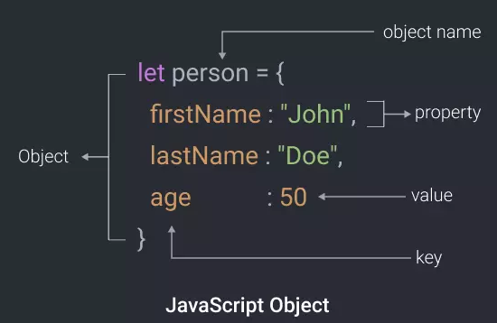

# Buổi 6: Objects

**Mục tiêu:** 

- Hiểu và sử dụng kiểu dữ liệu object trong TypeScript để quản lý và thao tác với dữ liệu phức tạp. 
- Biết cách thao tác với kiểu dữ liệu ngày giờ `Date`
- Biết cách thao tác với kiểu dữ liệu `JSON`

## 💛**Tìm hiểu về Object**

### 🔥1. **Khái niệm object**

Object trong JavaScript là một kiểu dữ liệu phức hợp (complex data type) được sử dụng để lưu trữ và tổ chức dữ liệu dưới dạng các cặp key-value. Object rất linh hoạt và là nền tảng cho hầu hết các cấu trúc dữ liệu trong JavaScript, bao gồm các instance của class, mảng, và thậm chí cả function.



**Đặc điểm của Object**

1. **Cấu trúc cặp key-value**:
   - Mỗi thuộc tính trong object là một **key** (tên) kết hợp với một **value** (giá trị).
   - Key thường là chuỗi hoặc symbol, còn value có thể là bất kỳ kiểu dữ liệu nào (số, chuỗi, hàm, mảng, hoặc thậm chí object khác).

   ```javascript
   const person = {
     name: "Alice", // Key: "name", Value: "Alice"
     age: 25,       // Key: "age", Value: 25
   };
   ```

2. **Dễ dàng mở rộng**:
   - Object có thể được thêm, sửa, hoặc xóa thuộc tính bất kỳ lúc nào.

3. **Dynamic Typing**:
   - JavaScript không yêu cầu định nghĩa trước kiểu dữ liệu cho object. Bạn có thể gán hoặc thay đổi bất kỳ kiểu dữ liệu nào vào thuộc tính.

---


### 🔥2. **Cách khai báo object**
- **Sử dụng kiểu tường minh và kiểu suy diễn**:
  ```typescript
  // Tường minh
  const person: { name: string; age: number } = { name: "Alice", age: 25 };

  // Suy diễn
  const product = { id: 101, name: "Laptop", price: 1500 }; // TypeScript tự suy diễn kiểu
  ```

- **Khai báo với `type` và `interface`**:
  ```typescript
  // Với type
  type User = {
    id: number;
    username: string;
    email: string;
  };

  const user: User = { id: 1, username: "john_doe", email: "john@example.com" };

  // Với interface
  interface Address {
    street: string;
    city: string;
    country: string;
  }

  const address: Address = { street: "Main St", city: "New York", country: "USA" };
  ```

### 🔥3. **Thuộc tính bắt buộc và thuộc tính tùy chọn**
- **Thuộc tính bắt buộc**:
  ```typescript
  interface Product {
    id: number;
    name: string;
    price: number;
  }

  const item: Product = { id: 101, name: "Book", price: 15 };
  ```

- **Thuộc tính tùy chọn** (dùng `?`):
  ```typescript
  interface Product {
    id: number;
    name: string;
    price?: number; // Tùy chọn
  }

  const item: Product = { id: 101, name: "Notebook" }; // Không cần có thuộc tính price
  ```

---

## 💛**Truy cập và thao tác với object**

### 🔥1. **Truy cập thuộc tính**
- **Dấu chấm (`.`)**:
  ```typescript
  const car = { brand: "Toyota", model: "Corolla" };
  console.log(car.brand); // Toyota
  ```

- **Ngoặc vuông (`[]`)**:
  ```typescript
  const car = { brand: "Toyota", model: "Corolla" };
  console.log(car["model"]); // Corolla
  ```

### 🔥2. **Thêm, sửa, xóa thuộc tính**
- **Thêm thuộc tính**:
  ```typescript
  const book = { title: "1984" };
  book.author = "George Orwell";
  console.log(book); // { title: "1984", author: "George Orwell" }
  ```

- **Sửa thuộc tính**:
  ```typescript
  const book = { title: "1984", author: "Unknown" };
  book.author = "George Orwell";
  ```

- **Xóa thuộc tính**:
  ```typescript
  const book = { title: "1984", author: "George Orwell" };
  delete book.author;
  console.log(book); // { title: "1984" }
  ```

---

## 💛**Lồng ghép object và các kiểu dữ liệu khác**

### 🔥1. **Object chứa mảng**
```typescript
interface Course {
  name: string;
  students: string[];
}

const course: Course = {
  name: "TypeScript Basics",
  students: ["Alice", "Bob", "Charlie"],
};
console.log(course.students[0]); // Alice
```

### 🔥2. **Mảng chứa object**
```typescript
const people = [
  { name: "Alice", age: 25 },
  { name: "Bob", age: 30 },
];
console.log(people[1].name); // Bob
```

### 🔥3. **Object lồng nhau**
```typescript
interface User {
  name: string;
  address: {
    city: string;
    postalCode: number;
  };
}

const user: User = {
  name: "Alice",
  address: {
    city: "Paris",
    postalCode: 75000,
  },
};

console.log(user.address.city); // Paris
```

---

## 💛**Duyệt qua object**

### 🔥1. **Dùng vòng lặp `for...in`**
```typescript
const user = { name: "Alice", age: 25 };

for (const key in user) {
  console.log(`${key}: ${user[key]}`);
}
// name: Alice
// age: 25
```

### 🔥2. **Dùng `Object.keys`, `Object.values`, `Object.entries`**
- **`Object.keys`**:
  ```typescript
  const user = { name: "Alice", age: 25 };
  console.log(Object.keys(user)); // ["name", "age"]
  ```

- **`Object.values`**:
  ```typescript
  console.log(Object.values(user)); // ["Alice", 25]
  ```

- **`Object.entries`**:
  ```typescript
  console.log(Object.entries(user)); // [["name", "Alice"], ["age", 25]]
  ```

---

## 💛**Kiểu dữ liệu thời gian `Date`**


`Date` là một đối tượng tích hợp sẵn (built-in object) trong JavaScript, được sử dụng để làm việc với **ngày** và **thời gian**. Nó cung cấp các phương thức để lấy, đặt, và định dạng thông tin liên quan đến ngày, giờ, phút, giây, và mili-giây.

---

### 🔥 **Khởi tạo một đối tượng `Date`**

Bạn có thể tạo một đối tượng `Date` bằng nhiều cách khác nhau:

1. **Ngày giờ hiện tại**:
   ```javascript
   const now = new Date();
   console.log(now); // Hiển thị ngày giờ hiện tại
   ```

2. **Tạo với timestamp (số mili-giây từ ngày 01/01/1970 UTC)**:
   ```javascript
   const timestamp = 1672531200000; // Ví dụ: timestamp
   const date = new Date(timestamp);
   console.log(date); // Hiển thị ngày giờ tương ứng với timestamp
   ```

3. **Tạo với chuỗi ngày giờ (ISO 8601 hoặc định dạng khác)**:
   ```javascript
   const date1 = new Date("2023-12-25"); // Chuỗi ISO
   const date2 = new Date("December 25, 2023 12:00:00"); // Chuỗi định dạng cụ thể
   console.log(date1);
   console.log(date2);
   ```

4. **Tạo với từng thành phần (năm, tháng, ngày, giờ, phút, giây, mili-giây)**:
   ```javascript
   const date = new Date(2023, 11, 25, 10, 30, 0); // Tháng bắt đầu từ 0 (11 là tháng 12)
   console.log(date); // Mon Dec 25 2023 10:30:00 GMT+0000 (UTC)
   ```

---

### 🔥**Các phương thức phổ biến của `Date`**

#### 1. **Lấy thông tin**
- **Năm, tháng, ngày, giờ...**:
  ```javascript
  const date = new Date();
  console.log(date.getFullYear()); // Năm hiện tại
  console.log(date.getMonth());    // Tháng (0-11, với 0 là tháng 1)
  console.log(date.getDate());     // Ngày trong tháng
  console.log(date.getHours());    // Giờ
  console.log(date.getMinutes());  // Phút
  console.log(date.getSeconds());  // Giây
  console.log(date.getMilliseconds()); // Mili-giây
  console.log(date.getDay());      // Ngày trong tuần (0 là Chủ Nhật, 6 là Thứ Bảy)
  ```

- **Timestamp (mili-giây từ ngày 01/01/1970 UTC)**:
  ```javascript
  console.log(date.getTime()); // Lấy timestamp
  ```

#### 2. **Đặt thông tin**
- Thay đổi ngày, giờ, hoặc các thành phần khác:
  ```javascript
  const date = new Date();
  date.setFullYear(2025);  // Đặt năm là 2025
  date.setMonth(0);        // Đặt tháng là tháng 1
  date.setDate(15);        // Đặt ngày là ngày 15
  date.setHours(10);       // Đặt giờ là 10
  console.log(date);
  ```

#### 3. **Định dạng ngày giờ**
- **Chuỗi ISO 8601**:
  ```javascript
  const date = new Date();
  console.log(date.toISOString()); // 2023-12-02T12:34:56.789Z
  ```

- **Định dạng cục bộ (locale)**:
  ```javascript
  console.log(date.toLocaleDateString("en-US")); // MM/DD/YYYY (ví dụ: 12/02/2023)
  console.log(date.toLocaleDateString("vi-VN")); // DD/MM/YYYY (ví dụ: 02/12/2023)
  ```

- **Chuyển sang chuỗi ngày giờ đầy đủ**:
  ```javascript
  console.log(date.toString()); // Sat Dec 02 2023 20:34:56 GMT+0700 (Indochina Time)
  ```

---

### 🔥**Ứng dụng thực tế**

#### 1. **Tính toán thời gian**
Bạn có thể so sánh hai ngày hoặc tính khoảng cách giữa chúng:
```javascript
const startDate = new Date("2023-12-01");
const endDate = new Date("2023-12-25");
const diff = endDate - startDate; // Kết quả là mili-giây
console.log(diff / (1000 * 60 * 60 * 24)); // Số ngày: 24
```

#### 2. **Đếm thời gian hiện tại so với mốc nào đó**
```javascript
const now = new Date();
const targetDate = new Date("2024-01-01");
const daysLeft = Math.ceil((targetDate - now) / (1000 * 60 * 60 * 24));
console.log(`Còn ${daysLeft} ngày đến Tết!`);
```

---

### 🔥**Lưu ý quan trọng về `Date`**

1. **Vấn đề múi giờ (Time Zones)**:
   - `Date` hoạt động theo thời gian địa phương (local time zone) hoặc UTC.
   - Để làm việc chính xác với múi giờ khác, cần sử dụng thư viện như **Moment.js** hoặc **Day.js**.

2. **Tháng bắt đầu từ 0**:
   - Trong `Date`, tháng được đánh số từ 0 đến 11, với 0 là tháng 1 và 11 là tháng 12.

3. **Không hỗ trợ định dạng phức tạp**:
   - `Date` không có sẵn các phương thức định dạng phức tạp (như định dạng "DD-MM-YYYY"). Để làm điều này, bạn cần sử dụng các thư viện hỗ trợ.

---

### 🔥**Thư viện hỗ trợ thao tác với Date**

#### 1. **Moment.js** (Ngừng phát triển nhưng vẫn dùng nhiều):
   ```javascript
   const moment = require("moment");
   console.log(moment().format("DD-MM-YYYY")); // 02-12-2023
   ```

#### 2. **Day.js** (Nhẹ và hiện đại):
   ```javascript
   const dayjs = require("dayjs");
   console.log(dayjs().format("DD/MM/YYYY")); // 02/12/2023
   ```

#### 3. **Luxon** (Làm việc với múi giờ tốt hơn):
   ```javascript
   const { DateTime } = require("luxon");
   console.log(DateTime.now().toISO()); // 2023-12-02T20:34:56.789+07:00
   ```


---

## 💛**JSON trong TypeScript và Node.js**

### 🔥**JSON là gì?**

**JSON** (viết tắt của **JavaScript Object Notation**) là một định dạng dữ liệu dạng văn bản dùng để lưu trữ và truyền tải dữ liệu. JSON dễ đọc với con người và dễ xử lý bởi máy tính, được sử dụng rộng rãi trong việc trao đổi dữ liệu giữa máy chủ (server) và ứng dụng (web hoặc mobile).


---

### 🔥**Đặc điểm của JSON**

1. **Dựa trên cú pháp của JavaScript**:
   - JSON được lấy cảm hứng từ cách định nghĩa object trong JavaScript.
   - Tuy nhiên, JSON độc lập với ngôn ngữ và được hỗ trợ bởi hầu hết các ngôn ngữ lập trình hiện nay.
   - JSON được lưu dưới dạng chuỗi văn bản thuần túy (Plain Text), có thể dễ dàng truyền qua mạng hoặc lưu trong cơ sở dữ liệu.

2. **Cấu trúc dữ liệu dạng key-value**:
   - Dữ liệu trong JSON được tổ chức dưới dạng **cặp key-value**.
   - Key luôn là chuỗi (**string**), còn value có thể là:
     - Chuỗi (**string**)
     - Số (**number**)
     - Boolean (**true/false**)
     - Mảng (**array**)
     - Object (cũng là một JSON)
     - `null`

3. **Dễ sử dụng và mở rộng**:
   - JSON có cấu trúc đơn giản, dễ đọc và ghi.
   - Phù hợp cho cả việc lưu trữ dữ liệu và trao đổi dữ liệu qua mạng.

---

### 🔥 **Cấu trúc của JSON**

#### 1. **Object (Đối tượng JSON)**:
Object trong JSON được bao quanh bởi dấu ngoặc nhọn `{}`, bên trong chứa các cặp key-value:
```json
{
  "name": "Alice",
  "age": 25,
  "isStudent": false
}
```

#### 2. **Array (Mảng JSON)**:
Mảng trong JSON được bao quanh bởi dấu ngoặc vuông `[]`, chứa danh sách các giá trị:
```json
{
  "students": [
    { "name": "Alice", "age": 25 },
    { "name": "Bob", "age": 22 }
  ]
}
```

#### 3. **Value (Giá trị trong JSON)**:
- Chuỗi (string): `"Alice"`
- Số (number): `25`, `3.14`
- Boolean: `true`, `false`
- Null: `null`
- Mảng: `[1, 2, 3]`
- Object: `{ "key": "value" }`

---

### 🔥**JSON so với JavaScript Object**

| **JSON**                                      | **JavaScript Object**                       |
|-----------------------------------------------|---------------------------------------------|
| Chuỗi JSON cần được đặt trong dấu ngoặc kép `"`. | Key của object trong JavaScript có thể không cần dấu ngoặc kép. |
| JSON không hỗ trợ hàm (function).              | JavaScript object có thể chứa hàm.          |
| JSON chỉ chứa dữ liệu tĩnh.                   | JavaScript object là một cấu trúc động.     |

**Ví dụ**:
```json
// JSON
{
  "name": "Alice",
  "age": 25
}
```
```javascript
// JavaScript Object
const person = {
  name: "Alice",
  age: 25,
  greet: function () {
    console.log("Hello!");
  },
};
```

---

### 🔥**Làm việc với JSON trong JavaScript**

#### 1. **Chuyển đổi từ Object sang JSON (`JSON.stringify`)**:
```javascript
const person = { name: "Alice", age: 25 };
const json = JSON.stringify(person);
console.log(json); // {"name":"Alice","age":25}
```

#### 2. **Chuyển đổi từ JSON sang Object (`JSON.parse`)**:
```javascript
const json = '{"name":"Alice","age":25}';
const person = JSON.parse(json);
console.log(person.name); // Alice
```

---

### 🔥**Ứng dụng của JSON**

1. **Truyền tải dữ liệu giữa client và server**:
   - Khi gọi API, dữ liệu trả về thường ở định dạng JSON.
   - Ví dụ: Kết quả từ API thời tiết:
     ```json
     {
       "temperature": 22.5,
       "condition": "Sunny",
       "location": "Hanoi"
     }
     ```

2. **Lưu trữ cấu hình và thiết lập**:
   - JSON thường được sử dụng để lưu trữ các tệp cấu hình, như `package.json` trong Node.js.

3. **Lưu trữ dữ liệu trong cơ sở dữ liệu NoSQL**:
   - Các cơ sở dữ liệu như MongoDB sử dụng JSON để lưu trữ dữ liệu.

4. **Trao đổi dữ liệu qua WebSocket**:
   - JSON là định dạng phổ biến khi gửi dữ liệu qua WebSocket trong các ứng dụng thời gian thực.

---

### 🔥**Ví dụ thực tế**

#### 1. **Sử dụng JSON trong Fetch API**:
```javascript
fetch("https://api.example.com/data")
  .then((response) => response.json())
  .then((data) => {
    console.log(data); // Dữ liệu JSON được chuyển thành object JavaScript
  });
```

#### 2. **Đọc và ghi tệp JSON trong Node.js**:
```javascript
const fs = require("fs");

// Đọc tệp JSON
const data = fs.readFileSync("data.json", "utf-8");
const jsonData = JSON.parse(data);
console.log(jsonData);

// Ghi tệp JSON
const newData = { name: "Alice", age: 25 };
fs.writeFileSync("data.json", JSON.stringify(newData, null, 2));
```

---

### 🔥**Ưu điểm và nhược điểm của JSON**

#### Ưu điểm:
- Đơn giản, dễ đọc và dễ sử dụng.
- Định dạng nhẹ, tiết kiệm băng thông khi truyền tải.
- Được hỗ trợ bởi hầu hết các ngôn ngữ lập trình.

#### Nhược điểm:
- Không hỗ trợ kiểu dữ liệu phức tạp (như hàm hoặc lớp).
- Không hỗ trợ chú thích (comments), gây khó khăn khi sử dụng trong tệp cấu hình.


